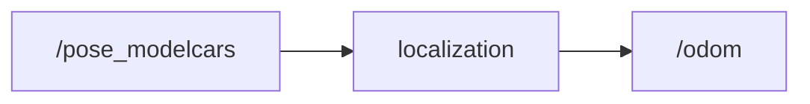

# Localization

ROS2 localization package for Autonomus Vehicles.

## Main Contributor

[Lindsay Shantha Rubia]

## Overview

This package receives motion capture data from the `/pose_modelcars topic`, which provides the current position and orientation of the ego vehicle. The data is filtered using a `Kalman Filter` to estimate a smoother and more accurate vehicle state. The filtered results — including position, orientation, linear velocity, and angular velocity — are published to the `/odom topic`. This odometry information is used for vehicle state estimation and navigation.

## Table of Contents

- [Block Diagram](#block-diagram)
- [Nodes](#nodes)
- [Parameters (Runtime-Adjustable)](#parameters-runtime-adjustable)
- [Dependencies](#dependencies)
- [Installation](#installation)
- [Usage](#usage)
- [Testing](#testing)
- [License](#license)


## Block Diagram



## Nodes

### Node: `localization`

Processes motion capture data and publishes ego-vehicle odometry.

#### Topics

| **Topic Name**     | **Direction** | **Type**                        | **Description**                                                                 |
|--------------------|---------------|----------------------------------|---------------------------------------------------------------------------------|
| `/pose_modelcars`  | Input         | `mocap_msgs/msg/RigidBodies`     | Provides position and orientation of multiple model cars using motion capture. |
| `/odom`            | Output        | `nav_msgs/msg/Odometry`          | Position, orientation, linear and angular velocity of the ego vehicle.         |

## Parameters (Runtime-Adjustable)

| Parameter Name     | Type     | Default Value | Description                                                  |
|--------------------|----------|---------------|--------------------------------------------------------------|
| `rigid_body_name`  | string   | `11`          | ID of the rigid body to track from the `/pose_modelcars` topic. |

## Dependencies

This package depends on the following ROS 2 packages and message definitions:

- ROS 2 Humble .
- [`mocap_msgs`](https://git.hs-coburg.de/pau5849s/mocap_msgs) — Custom message definitions for motion capture data.
- filterpy pkg : `pip3 install filterpy`


```bash
```


## Installation

1. Clone the repository:
   ```bash
   git clone https://git.hs-coburg.de/TEAM_BLAZE/localization.git
   ```
2. Change directory to `localization` 
   ```bash
   cd localization.
   ```

2. Clone this repository `mocap_msgs` by using the next command :
   ```bash
   git clone https://git.hs-coburg.de/pau5849s/mocap_msgs.
   ```

3. Build the package:
   ```bash
   colcon build --packages-select localization_pkg mocap_msgs

   ```

4. Source the workspace:
   ```bash
   source install/setup.bash
   ```

5. Clone model city map and follow the steps :
   ```bash
   git clone https://git.hs-coburg.de/Autonomous_Driving/model_city_map

   python3 convert_to_binary.py

   python3 MakeROSMap.py

   ros2 launch nav2_bringup localization_launch.py map:=$(pwd)'/mc24.yaml'
   ```


## Usage

### Launching the Node

To launch all nodes in the localization package, run:
```bash
ros2 run localization_pkg localization_node
```

Ensure your motion capture system is actively publishing to the `/pose_modelcars` topic before launching and ensure that you already cloned `mocap_msgs` .

## Testing

### Unit Tests

To run the unit tests for this package:
1.colcon test
```bash
colcon test --packages-select localization_pkg
```
2.run next command for unit tests :
```bash
pytest localization_pkg/test/test_localization_node.py
```


## License

This project is licensed under the **Apache 2.0 License** – see the [LICENSE](LICENSE) file for details.
